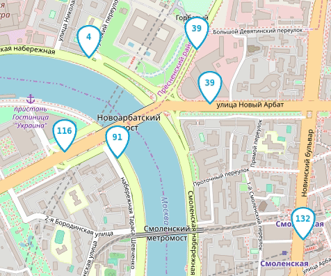
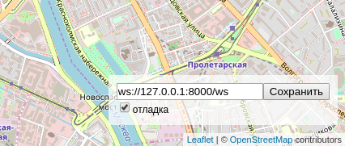

# Автобусы на карте Москвы

Веб-приложение показывает передвижение автобусов на карте Москвы.



## Как запустить

- Скачайте код
- Откройте в браузере файл index.html

Для полноценной работы с движущимися автобусами потребуется запустить сервер и имитатор автобусов.

#### 1. Установка зависимостей

```bash
python -m venv venv
source venv/bin/activate  # Linux/Mac
# или
venv\Scripts\activate  # Windows

pip install -r requirements.txt
```

#### 2. Запуск сервера 

```bash
python server.py
```

Опции сервера:

- -b, --bus-port - порт для имитатора автобусов (по умолчанию: 8080)
- -r, --browser-port - порт для браузера (по умолчанию: 8000)
- -v, --verbose - детализация логирования

Пример:
```bash
python server.py --bus-port 8080 --browser-port 8000 -v
```

#### 3. Запуск имитатора автобусов (в другом терминале)

```bash
python fake_bus.py
```

Опции имитатора:

- -s, --server - адрес сервера (по умолчанию: ws://127.0.0.1:8080)
- -r, --routes-number - количество маршрутов (по умолчанию: 10)
- -b, --buses-per-route - автобусов на маршрут (по умолчанию: 5)
- -w, --websockets-number - количество WebSocket соединений (по умолчанию: 5)
- -t, --refresh-timeout - интервал обновления, сек (по умолчанию: 0.5)
- -v, --verbose - детализация логирования

Пример:

```bash
python fake_bus.py --routes-number 20 --buses-per-route 10 -v
```

## Тестирование безопасности

Для проверки устойчивости сервера к некорректным данным предусмотрены тестовые скрипты.

#### harmful_client.py - тестирование безопасности браузера

Скрипт имитирует вредоносного клинта, отправляя некорректные данные и проверяя ответы сервера.
```bash
python harmful_client.py
```

Сценарии тестирования:

- Отправка невалидного JSON
- Отсутствие обязательного поля msgType
- Некорректные границы карты (юг > север)
- Отсутствие полей в данных границ
- Неизвестный тип сообщения


#### harmful_bus.py - тестирование безопасности автобусов

Скрипт имитирует вредоносный автобус, отправляя нкоррректные данные и проверяя ответы сервера.

```bash
python harmful_bus.py
```

Сценарии тестирования:

Отсутствие обязательных полей (busId, lat, lng, route)
- Неправильные типы данных (число вместо строки и наоборот)
- Координаты вне допустимого диапазона (широта -90..90, долгота -180..180)
- SQL инъекции и XSS атаки
- Очень длинные строки (потенциальный DoS)
- null значения

#### Запуск всех тестов

```bash
# Терминал 1: Запуск сервера
python server.py -v

# Терминал 2: Тестирование браузера
python harmful_client.py

# Терминал 3: Тестирование автобуса
python harmful_bus.py
```

## Настройки

Внизу справа на странице можно включить отладочный режим логгирования и указать нестандартный адрес веб-сокета.



Настройки сохраняются в Local Storage браузера и не пропадают после обновления страницы. Чтобы сбросить настройки удалите ключи из Local Storage с помощью Chrome Dev Tools —> Вкладка Application —> Local Storage.

Если что-то работает не так, как ожидалось, то начните с включения отладочного режима логгирования.

## Формат данных

Фронтенд ожидает получить от сервера JSON сообщение со списком автобусов:

```js
{
  "msgType": "Buses",
  "buses": [
    {"busId": "c790сс", "lat": 55.7500, "lng": 37.600, "route": "120"},
    {"busId": "a134aa", "lat": 55.7494, "lng": 37.621, "route": "670к"},
  ]
}
```

Те автобусы, что не попали в список `buses` последнего сообщения от сервера будут удалены с карты.

Фронтенд отслеживает перемещение пользователя по карте и отправляет на сервер новые координаты окна:

```js
{
  "msgType": "newBounds",
  "data": {
    "east_lng": 37.65563964843751,
    "north_lat": 55.77367652953477,
    "south_lat": 55.72628839374007,
    "west_lng": 37.54440307617188,
  },
}
```


## Используемые библиотеки

- [Leaflet](https://leafletjs.com/) — отрисовка карты
- [loglevel](https://www.npmjs.com/package/loglevel) для логгирования


## Цели проекта

Код написан в учебных целях — это урок в курсе по Python и веб-разработке на сайте [Devman](https://dvmn.org).
